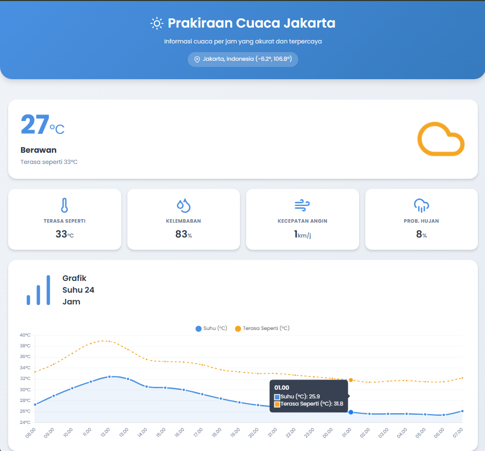
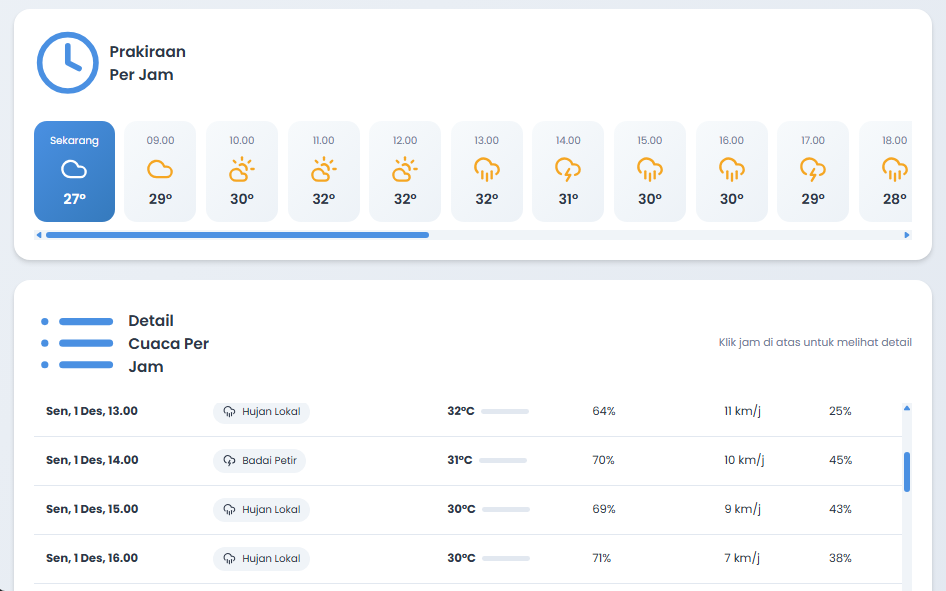

# Prakiraan Cuaca Jakarta

Aplikasi web modern untuk menampilkan prakiraan cuaca per jam di Jakarta dengan tampilan UI/UX flat yang sederhana dan informatif.




## Fitur

- 🌡️ **Cuaca Saat Ini** - Menampilkan suhu, kondisi cuaca, dan "terasa seperti"
- 📊 **Grafik Interaktif** - Visualisasi suhu 24 jam ke depan dengan Chart.js
- 🕐 **Prakiraan Per Jam** - Scroll horizontal untuk melihat cuaca tiap jam
- 📋 **Tabel Detail** - Data lengkap cuaca 48 jam ke depan
- 🎨 **Desain Modern** - UI/UX flat dengan animasi halus
- 📱 **Responsif** - Tampilan optimal di semua ukuran layar
- 🔄 **Auto-refresh** - Data diperbarui setiap 30 menit

## Data yang Ditampilkan

| Field | Deskripsi |
|-------|-----------|
| `temperature_2m` | Suhu udara (°C) |
| `apparent_temperature` | Suhu yang terasa (°C) |
| `relative_humidity_2m` | Kelembaban relatif (%) |
| `wind_speed_10m` | Kecepatan angin (km/jam) |
| `precipitation_probability` | Probabilitas hujan (%) |
| `weather_code` | Kode kondisi cuaca (cerah, berawan, hujan, dll.) |

## Teknologi

- **HTML5** - Struktur halaman
- **CSS3** - Styling dengan CSS Variables, Flexbox, Grid, dan Animasi
- **JavaScript (Vanilla)** - Logika aplikasi
- **[Chart.js](https://www.chartjs.org/)** - Grafik suhu interaktif
- **[Google Fonts (Poppins)](https://fonts.google.com/specimen/Poppins)** - Typography modern
- **[Open-Meteo API](https://open-meteo.com/)** - Data cuaca gratis

## Sumber Data

API URL:
```
https://api.open-meteo.com/v1/forecast?latitude=-6.2&longitude=106.8&hourly=temperature_2m,relative_humidity_2m,apparent_temperature,precipitation_probability,weather_code,wind_speed_10m&current=temperature_2m,relative_humidity_2m,apparent_temperature,weather_code,wind_speed_10m&timezone=Asia/Jakarta
```

- Latitude: -6.2 (Jakarta)
- Longitude: 106.8 (Jakarta)
- Timezone: Asia/Jakarta

## Cara Menggunakan

1. Buka file `index.html` di browser modern (Chrome, Firefox, Safari, Edge)
2. Data cuaca akan dimuat secara otomatis dari API
3. Lihat cuaca saat ini di bagian atas
4. Scroll ke bawah untuk melihat grafik dan detail per jam
5. Gunakan horizontal scroll untuk melihat prakiraan per jam

## Fitur UI/UX

- **Header Gradient** - Warna biru yang menenangkan
- **Kartu Statistik** - Menampilkan data penting dengan ikon
- **Grafik Line Chart** - Visualisasi tren suhu
- **Horizontal Scroll** - Prakiraan per jam yang mudah dinavigasi
- **Tabel dengan Color Coding** - Indikator visual untuk suhu
- **Animasi Halus** - Transisi dan hover effects
- **Loading State** - Spinner animasi saat memuat data
- **Error State** - Pesan error yang jelas dan informatif

## Ikon Cuaca

Aplikasi menampilkan ikon SVG untuk berbagai kondisi cuaca:
- ☀️ Cerah
- 🌤️ Cerah Berawan
- ☁️ Berawan
- 🌫️ Berkabut
- 🌧️ Hujan
- ⛈️ Badai Petir

## Lisensi

MIT License - Bebas digunakan dan dimodifikasi.
